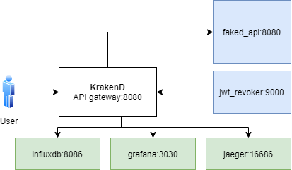

# Mục đích
Thử nghiệm KrakenD API gateway



| Endpoint | Backend |
| ---- | ------- |
| /splash | faked_api:8080/campaigns.json |
| /sequential | faked_api:8080/hotels/1.json + faked_api:8080/destinations/{destination_id}.json |
| /fail | http://fake_url_that_should_not_resolve.tld/user1/1.json |
| public | https://api.github.com/users/kpacha
| private/custom (require JWT token) | faked_api:8080/user/1.json |
# Hướng dẫn
### Bước 1: Start lab, review cấu hình của KrakenD
```bash
docker-compose up

http://vagrant-ip:8787 , upload file krakend/krakend.json
```
### Bước 2: Test access unauthenticated APIs
```bash

# review backend server
curl http://vagrant-ip:8000/

curl http://vagrant-ip:8080/splash
curl http://vagrant-ip:8080/sequential
curl http://vagrant-ip:8080/fail
curl http://vagrant-ip:8080/public

# Xem log trên grafana
http://vagrant-ip:3003 , login bằng admin/admin

# Xem tracing trên jaeger
http://vagrant-ip:16686
```

### Bước 3: Test access authenticated API
```bash
curl http://vagrant-ip:8080/private/custom
# lỗi 403

# Tạo jwt token
curl http://vagrant-ip:8080/token
# krakend sẽ gọi đến http://fake_api:8080/jwk/symmetric.json để generate token

# request với token ở trên
curl http://vagrant-ip:8080 private/custom -H "Accept: application/json" -H "Authorization: Bearer {token}"
# success
# dùng https://jwt.io/ để decode token

# revoke token
http://vagrant-ip:9000 , revoke token có giá trị jti = "..."

# request với token cũ
curl http://vagrant-ip:8080 private/custom -H "Accept: application/json" -H "Authorization: Bearer {token}"
# lỗi 403
```

# Tài liệu tham khảo
- https://github.com/devopsfaith/krakend-playground