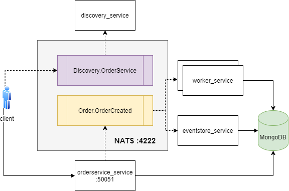

# Mục đích
Thử nghiệm gọi GRPC qua NATS


# Hướng dẫn
### Chuẩn bị
```bash
# start nats server
nats-server -V

# start mongodb server bằng docker hoặc https://cloud.mongodb.com
# edit store/store.go : ApplyURI("mongodb+srv://...

# compile proto
protoc --go_out=. --go_opt=paths=source_relative --go-grpc_out=. --go-grpc_opt=paths=source_relative order/order.proto
```

### Start services
```bash
# run discovery_service (GRPC over NATS)
#  subscribe subject "Discovery.OrderService", return địa chỉ của order_service
go run discovery.go

# run order_service (GRPC server)
# CreateOrder(): insert record vào bảng orders trong MongODB, sau đó push message đến subject "Order.OrderCreated"
# GetOrders(): return orders từ MongoDB
go run server.go

# run worker_services:
# subscribe subject "Order.OrderCreated", insert record vào bảng events trong MongoDB
go run worker1.go
go run worker2.go

# run eventstore_service:
go run eventstore.go
# subscribe topic "Order.>", insert record vào bảng events trong MongoDB
```

### Run client
```bash
go run client.go
# gởi request đến subject "Discovery.OrderService" để lấy địa chỉ của order_service (asynchronous)
# gọi rpc CreateOrder() và GetOrders() của request (synchronous)
```

# Tài liệu tham khảo
- https://shijuvar.medium.com/introducing-nats-to-go-developers-3cfcb98c21d0
- https://www.hackster.io/davidefa/esp32-wireless-mesh-made-easy-with-painlessmesh-part-3-982af1 (kết hợp ESP32 wifi mesh với MQTT)