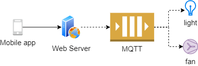

# Mục đích
Thử nghiệm điều khiển thiết bị IoT bằng MQTT



| Use case | Role | Subscribe vào topic | Xử lý nội bộ | Push mesage đến topic |
| - | - | - | - | - |
Lấy trạng thái của các device | server | home/+/info, home/+/stat | |
| | client | | | home/{device}/info, home/{device}/stat |
| Gởi lệnh đến 1 device cụ thể | server | home/+/ret | | home/{device}/cmd |
| | client | home/{device}/cmd | | home/{device}/ret |
| Gởi lệnh đến tất cả thiết bị | server | home/+/ret | | home/$broadcast/alert |
| | client | home/$broadcast/# | | home/{device}/ret |

#### 
# Hướng dẫn
### Chuẩn bị
```bash
# run mqtt server
docker run --rm -it -p 1883:1883 -v `pwd`/mosquitto.conf:/mosquitto/config/mosquitto.conf eclipse-mosquitto
```
### Start services
```bash
go mod tidy

go run server.go

go run client.go light
go run client.go fan
```

### Test điều khiển thiết bị

```bash
#  download http client (Insomnia, Postman app, Thunder client)

# lấy thông tin của các thiết bị
GET http://vagrant-ip:8080/devices

GET http://vagrant-ip:8080/info/light
GET http://vagrant-ip:8080/info/fan

GET http://vagrant-ip:8080/stat/light
GET http://vagrant-ip:8080/stat/fan

# gởi lệnh đến 1 thiết bị
POST http://vagrant-ip:8080/cmd/light
{
	"id": "1a",
	"content":"power_on"
}

GET http://vagrant-ip:8080/ret/light

# gởi lệnh đến tất cả thiết bị
http://vagrant-ip:8080/broadcast
{
	"alert":"fire"
}
```

# Tài liệu tham khảo
- https://pi3g.com/2019/05/29/mqtt-topic-tree-design-best-practices-tips-examples/ (best practices về thiết kế MQTT topics trong IoT)
- https://homieiot.github.io/ (MQTT Convention for IoT)