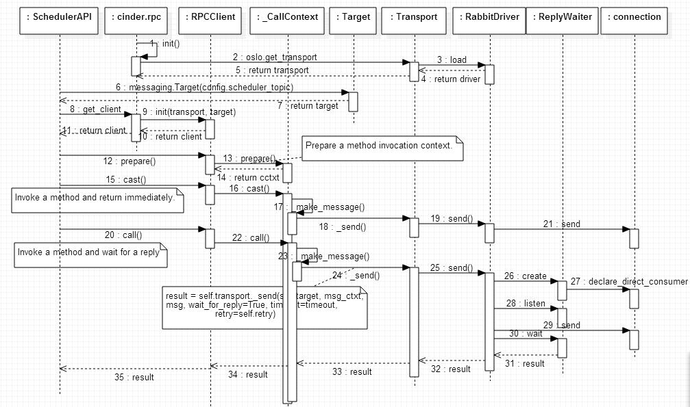

# Mục đích
Thử nghiệm tạo microservices bằng oslo.messaging

# Hướng dẫn 
```bash
# chuẩn bị
docker run --rm -it -p 5672:5672 -p 15672:15672 rabbitmq:3-management

pip3 install oslo.messaging --user

```

### Tutorial 1: Basic
https://github.com/kgiusti/oslo-messaging-clients

```bash
python3 ./tutorial-1/rpc-server.py --config-file ./config/oslo.conf --name MyServer
python3 ./tutorial-1/rpc-client.py --config-file ./config/oslo.conf --method echo --kwargs "arg1=value1 arg2=value2"
```

### Tutorial 2: Advanced
http://fosshelp.blogspot.com/2015/02/openstack-oslo-messaging-rpc-api.html
```bash
# start các server
python3 ./tutorial-2/server.py --config-file ./config/oslo.conf --name a
python3 ./tutorial-2/server.py --config-file ./config/oslo.conf --name b

# test gởi request đến một server cụ thể
python3 ./tutorial-2/client.py --config-file ./config/oslo.conf --server a
python3 ./tutorial-2/client.py --config-file ./config/oslo.conf --server b

# test gởi request đến một trong các server để xử lý
python3 ./tutorial-2/client.py --config-file ./config/oslo.conf

# test gởi request đến tất cả server
python3 ./tutorial-2/client.py --config-file ./config/oslo.conf --fanout
```

# Phân tích cách dùng olso.messaging trong Openstack
### 1. Phân tích Cinder
#### Kiến trúc:


#### Cách tổ chức topic:


#### Code flow
##### Code flow phía client:


##### Code flow phía server:


### 2. Cơ chế gọi RPC của Openstack:
Tổng quát: mỗi service (nova, cinder, ...) của openstack sẽ listen trên 2 queue bind đến 'service' exchange:
- compute.hostname (routing key = NODE-TYPE.NODE-ID)
- compute (routing key = NODE-TYPE)

Các thông số của một RPC call gồm (exchange, topic, namespace, version, server, fanout)

#### Gọi rpc trên 1 trong số nhiều server
- nova-api call run_instance() -> nova exchange / scheduler topic (nova-schedulers  listening)
- nova-compute call instance_update() -> nova exchange / conductor (nova-conductors listening)

#### Gọi rpc trên một server cụ thể
- nova-scheduler call run_instance() -> nova exchange / foobar topic (foobar server listening)
- nova-api  call terminate_instance() -> nova exchange / foobar topic (foobar server listening)

##### Gọi rpc trên tất cả server
- nova-compute định kỳ run 'update_service_capabilities' ở fanout mode -> nova exchange / scheduler topic (nova-schedulers listening)
- khi startup, nova-scheduler run 'publish_service_capabilities' ở fanout mode -> nova exchange / compute topic (nova-computing servers listen)

# Tài liệu tham khảo
- https://docs.openstack.org/nova/queens/reference/rpc.html
- https://www.cnblogs.com/sammyliu/p/4335339.html
- https://www.cnblogs.com/luohaixian/p/11084279.html
- https://www.thedigitalcatonline.com/blog/2013/08/21/some-tips-about-amqp-direct-exchanges/ (ví dụ thiết kế topics)