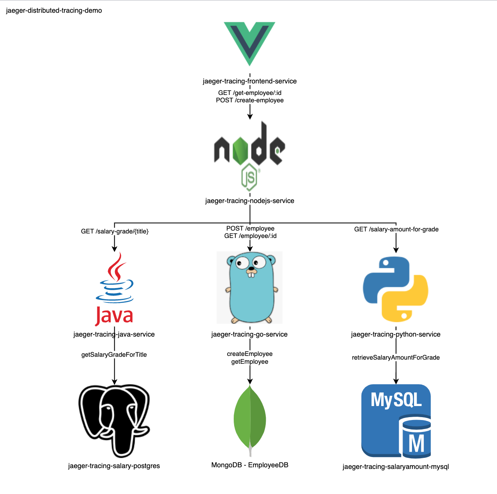

# Mục đích
Thử nghiệm distributed tracing bằng opentelemetry và jaeger



### Flow code tạo employee:
| Step | Action |
| - | - |
| 1 | client send "POST /create-employee" đến nodejs-service |
| 2 | nodejs-service send "GET /salary-grade/{title}" đến java-service để lấy bậc lương theo title |
| 2 | nodejs-service send "GET /salary-amount-for-grade" đến python-service để lấy min-max lương theo bậc |
| 2 | nodejs-service send "POST /employee" đến go-service để insert data vào MongoDB |
| 3 | nodejs-service trả về kết quả cho client |

### Flow code xem employee:
| Step | Action |
| - | - |
| 1 | client send "GET /get-employee" đến nodejs-service |
| 2 | nodejs-service send "GET /employee" đến go-service query thông tin của employee từ MongoDB |
| 3 | nodejs-service trả kết quả cho client |

# Hướng dẫn
### Build và run services
```bash
# chuẩn bị

# build java app
cd jaeger-tracing-java-service
./gradlew build
cd ..

# edit VUE frontend: thay thế "localhost" bằng vagrant-ip "172.16.1.2"
grep -rl 'localhost' jaeger-tracing-frontend-service/src/components | xargs sed -i 's/localhost/172.16.1.2/g'

docker-compose build
docker-compose up
```

### Test 1: Trace gọi service
#### Trace add employee
http://vagrant-ip:8080/ ,  Add Employee
- First name: Joe
- Liat name: Bloggs 
- Occupation: Senior Software Engineer

=> EmployeID: eed2c8df-49d6-4a95-8702-0a92c81173db

http://vagrant-ip:16686 , trace POST /create-employee/

#### Trace view employee
http://vagrant-ip:8080/ , Get Employee : eed2c8df-49d6-4a95-8702-0a92c81173db
http://vagrant-ip:16686 , trace GET /get-employee/

### Test 2: Trace service lỗi
### Trace lỗi go-service
```bash
docker-compose rm -s jaeger-tracing-go-service

# Add Employee -> trace -> Tags / http.error_message

docker-compose up jaeger-tracing-go-service
```
#### Trace lỗi java-service
```bash
docker-compose rm -s jaeger-tracing-java-service

# Add Employee -> trace -> Tags / http.error_message

docker-compose up jaeger-tracing-java-service
```


# Tài liệu tham khảo
- https://capgemini.github.io/development/Distributed-Tracing-with-OpenTelemetry-And-Jaeger/
